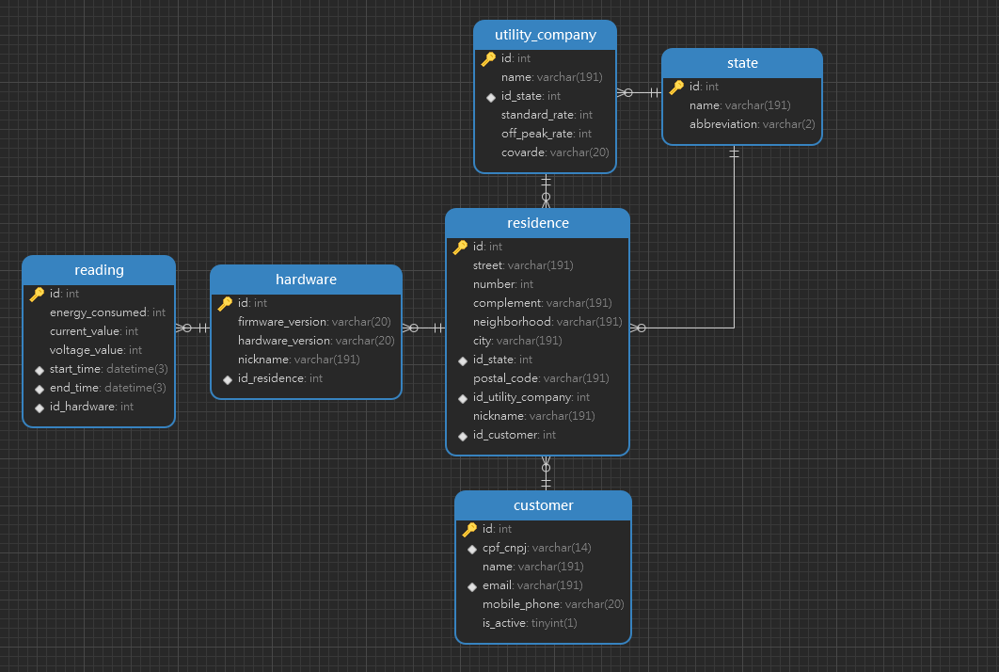
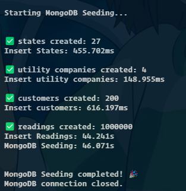
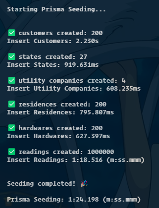

<p align="center">
  <a href="http://nestjs.com/" target="blank"></a>
</p>

[circleci-image]: https://img.shields.io/circleci/build/github/nestjs/nest/master?token=abc123def456
[circleci-url]: https://circleci.com/gh/nestjs/nest

# Project Energy (IoT)
Store the energy readings with intervals of 3 seconds. The application is built with NestJS and uses both MySQL and MongoDB databases, with Prisma as the ORM for MySQL and Mongoose for MongoDB. The application provides a RESTful API for managing energy readings, including features for adding, retrieving, updating, and deleting readings.

Why? To compare performance and scalability of both databases in a real-world scenario.

To compare I'm using two Ec2 intances:
- **MySQL**: `t2.micro` (Ubunto:24) instance with 1 vCPU and 1 GiB of memory 8GB.
- **MongoDB**: `t2.micro` (Ubunto:24)  instance with 1 vCPU and 1 GiB of memory 8GB.
- **NestJS**: `t2.micro` (Ubunto:24) instance with 1 vCPU and 1 GiB of memory 16GB.

[](https://nestjs.com/)
[](https://www.mysql.com/)
[](https://www.mongodb.com/)
[](https://www.prisma.io/)
[](https://mongoosejs.com/)
[](https://aws.amazon.com/)
[](https://aws.amazon.com/ec2/)

## Table of Contents
- [Project setup](#project-setup)
- [Database setup](#database-setup)
  - [MySQL](#mysql)
  - [MongoDB](#mongodb)
- [Compile and run the project](#compile-and-run-the-project)
- [API Swagger Documentation](#api-swagger-documentation)
- [Relational ERD](#relational-erd)
- [Performance Tests - Consumer Energy Readings](#performance-tests---consumer-energy-readings)
  - [Total readings (1.000.000 registers)](#total-readings-1000000-registers)
  - [Search in one month range](#search-in-one-month-range-2025-06-29t120000z-to-2025-07-29t120000z)
  - [Search by residence 1 in one month range](#search-by-residence-1-in-one-month-range-2025-06-29t120000z-to-2025-07-29t120000z)
  - [Search by state 33 (RJ) in one month range](#search-by-state-33-rj-in-one-month-range-2025-06-29t120000z-to-2025-07-29t120000z)
  - [Search by utility company 4 in one month range](#search-by-utility-company-4-in-one-month-range-2025-06-29t120000z-to-2025-07-29t120000z)
  - [Creating a new reading](#creating-a-new-reading)
  - [Updating a reading](#updating-a-reading)
  - [Deleting a reading](#deleting-a-reading)
  - [Initial fake data insertion](#initial-fake-data-insertion)
- [License](#license)
## Requirements
- Node.js (v18 or later)

# Energy Readings API
This project is a NestJS application that serves as a RESTful API for managing energy readings. It supports both MySQL and MongoDB databases, allowing you to choose the database that best fits your needs.


## Project setup

```bash
$ npm install
```

Before the database setup, you need to create a `.env` file in the root directory of the project. You can use the `.env.example` file as a template. Make sure to set the environment variables for both MySQL and MongoDB connections. I created a docker-compose file to run both databases locally, you can use it to test the project.

```bash
docker-compose up -d
```

## Database setup
### MySQL
Migrate the database schema using Prisma:
```bash
$ npm run prisma:m
```
Generate Prisma client:
```bash
$ npm run prisma:g
```
Seed the database with initial data:
```bash
$ npm run seed:sql
```
### MongoDB
Migrate the database schema
```bash
$ npm run mongo:up
```
Seed the database with initial data:
```bash
$ npm run seed:nosql
```

## Compile and run the project

```bash
# development
$ npm run start

# watch mode
$ npm run start:dev

# production mode
$ npm run start:prod
```
## API Swagger Documentation
To create a NestJS application that serves as a RESTful API for managing a collection of books, including features for adding, retrieving, updating, and deleting books: http://localhost:3000/api


# Relational ERD


# Performance Tests - Consumer Energy Readings
### Total readings (1.000.000 registers)
NoSQL:
- 620.524 ms
- 600.568 ms

SQL:
- 2.7101 s
- 2.4061 s

### Search in one month range (2025-06-29T12:00:00Z to 2025-07-29T12:00:00Z):
NoSQL (863.163 registers):
- 845.917 ms
- 837.434 ms

SQL (863.307 registers):
- 1.5945 s
- 1.2670 s

### Search by residence 1 in one month range (2025-06-29T12:00:00Z to 2025-07-29T12:00:00Z):
NoSQL (4.330 registers):
- 179.563 ms
- 187.200 ms

SQL (4.262 registers):
- 328.213 ms
- 171.104 ms

### Search by state 33 (RJ) in one month range (2025-06-29T12:00:00Z to 2025-07-29T12:00:00Z):
NoSQL (337.069 registers):
- 603.715 ms
- 594.813 ms

SQL (262.996):
- 1.1459 s
- 925.286 ms

### Search by utility company 4 in one month range (2025-06-29T12:00:00Z to 2025-07-29T12:00:00Z):
NoSQL (284.537 registers):
- 553.321 ms

SQL (272.166):
- 1.2236 s

### Creating a new reading:
NoSQL:
- 152.882 ms

SQL:
- 602.308 ms

### Updating a reading:
NoSQL:
- 171.722 ms

SQL:
- 1.2072 s

### Deleting a reading:
NoSQL:
- 148.294 ms

SQL:
- 1.0485 s

### Initial fake data insertion:




## License

Nest is [MIT licensed](https://github.com/nestjs/nest/blob/master/LICENSE).


### [Go to top](#project-energy-iot)